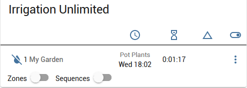
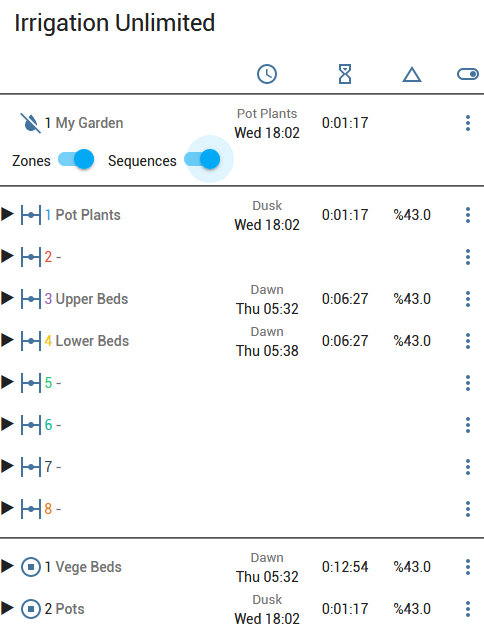

# Irrigation Unlimited

[![GitHub Release][releases-shield]][releases]
[![GitHub Activity][commits-shield]][commits]
[![License][license-shield]][license]
[![vps][vpsbadge]][vps]
[![Project Maintenance][maintenance-shield]][user_profile]

![exampleimg]

## Overview

This integration is for irrigation systems large and small. It can offer some complex arrangements without large and messy scripts. This integration will complement many other irrigation projects.

## Features

1. Unlimited controllers.
2. Unlimited zones.
3. Unlimited schedules. Schedule by absolute time or sun events (sunrise/sunset). Select by days of the week (mon/tue/wed...). Select by days in the month (1/2/3.../odd/even). Select by months in the year (jan/feb/mar...).  Use cron expressions. Overlapped schedules.
4. Unlimited sequences. Operate zones one at a time in a particular order with a delay in between. A 'playlist' for your zones.
5. Plenty of under-the-hood service calls to programmatically fine-tune irrigation requirements (enable/disable/toggle, pause/resume, suspend/cancel, manual_run, adjust_time, load_schedule, reload)
7. Suitable for indoor (greenhouse, hothouse, undercover areas) and outdoor (gardens, lawns, crops).
8. Hardware independent. Use your own switches/valve controllers.
9. Software independent. Pure play python.

*Practical limitations will depend on your hardware.

From release 2022.4.0 a [companion card](https://github.com/Vioneta/vioneta-irrigation-card) is available. This card works well on mobile devices.

and expands to

## Installation

1. Click install.
2. See the [repository][irrigation] for detailed setup instructions.

## Configuration is done in the configuration.yaml

<!---->

***

[irrigation]: https://github.com/Vioneta/vioneta-irrigation-integration
[commits-shield]: https://img.shields.io/github/commit-activity/y/Vioneta/vioneta-irrigation-integration.svg?style=for-the-badge
[commits]: https://github.com/Vioneta/vioneta-irrigation-integration/commits/master
[vps]: https://vps.vioneta.com
[vpsbadge]: https://img.shields.io/badge/VPS-Custom-orange.svg?style=for-the-badge
[exampleimg]: example.png
[license]: https://github.com/Vioneta/vioneta-irrigation-integration/blob/main/LICENSE
[license-shield]: https://img.shields.io/github/license/Vioneta/vioneta-irrigation-integration.svg?style=for-the-badge
[maintenance-shield]: https://img.shields.io/badge/maintainer-Vioneta%20Team%20%40Vioneta-blue.svg?style=for-the-badge
[releases-shield]: https://img.shields.io/github/release/Vioneta/vioneta-irrigation-integration.svg?style=for-the-badge
[releases]: https://github.com/Vioneta/vioneta-irrigation-integration/releases
[user_profile]: https://github.com/Vioneta
